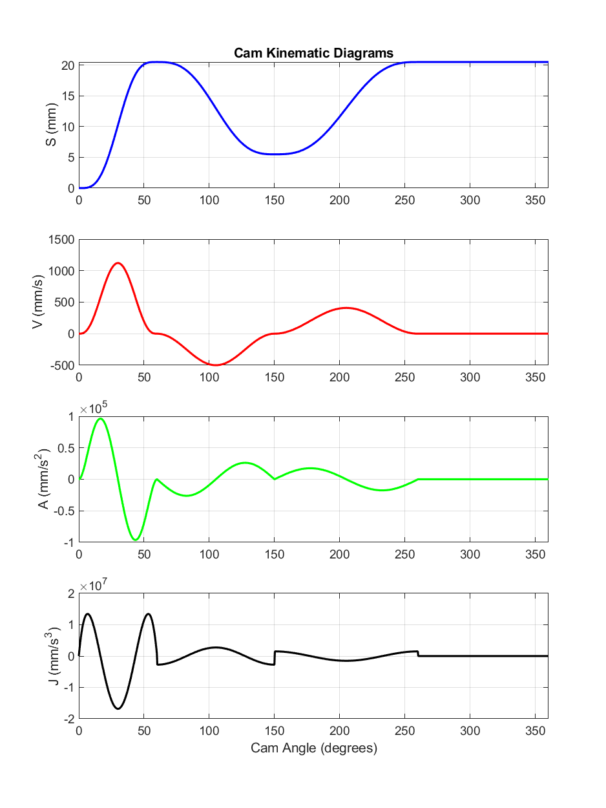

# Cam Design — S-V-A-J Kinematic Diagrams

MATLAB script for synthesizing the displacement, velocity, acceleration, and
jerk (S-V-A-J) profiles of a multi-segment disk cam, following standard cam
design methodology (Norton, *Design of Machinery*).

## Cam Motion Program

| Segment | Cam Angle (deg) | Motion Type            | Displacement       |
|---------|------------------|-------------------------|--------------------|
| 1       | 0 – 60           | 4-5-6-7 Polynomial Rise | 0 → 20.5 mm        |
| 2       | 60 – 150         | Cycloidal Return (fall) | 20.5 → 5.5 mm      |
| 3       | 150 – 260        | Cycloidal Rise          | 5.5 → 20.5 mm      |
| 4       | 260 – 360        | Dwell                   | 20.5 mm (constant) |

Cam speed: 250 rpm (ω = 26.18 rad/s).

## Files

- `cam_design_SVAJ.m` — MATLAB script; computes and plots S, V, A, J over
  one full cam rotation (0–360°).
- `SVAJ_diagrams.png` — Output plot.

## Requirements

- MATLAB 2023b (no additional toolboxes required)

## Usage

```matlab
cam_design_SVAJ
```

This generates the four-panel S-V-A-J plot and saves it as
`SVAJ_diagrams.png`.

## Author

Aliakbar Hoveydapour

##LICENCE

MIT
